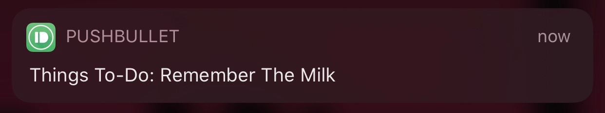
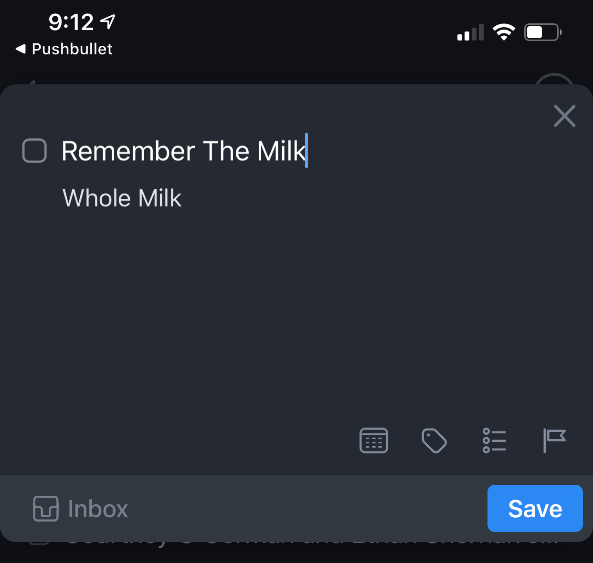

# Things To Pushbullet Instructions

## Set up Pushbullet
1. Get a  [Pushbullet Account](https://www.pushbullet.com/) 
2. Install the  [Pushbullet App](https://apps.apple.com/us/app/pushbullet/id810352052)  on your iOS device
3. Sign into Pushbullet on your iOS device (note if Push notifications don’t work, sign out and sign in again on the iOS device)

## Get your Pushbullet Access Token
1. Go to the  [Pushbullet Account Page](https://www.pushbullet.com/#settings/account) 
2. Click **Create Access Token**
3. Make note of your access token

## Get your Things Authentication Token
**on iOS**
1. Launch Things
2. Go to Settings (bottom of screen)
3. Go to General
4. Select Things URLs
5. Make note of your authentication token

## Try it out
1. Navigate to the  [Things to Pushbullet Page](http://things-to-pushbullet.s3.amazonaws.com/Things-to-Pushbullet.html) 
2. Enter the Things Authentication token into the **auth-token** field on the page and click **Save**
3. Enter the Pushbullet Access token into the **pushbullet-auth-token** field on the page and click **Save**
4. Enter a title and any other data you like and click **Send to Pushbullet**

You should get a notification

tapping the notification will display this

